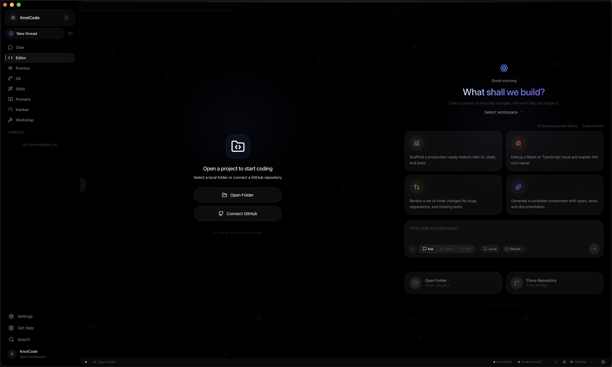
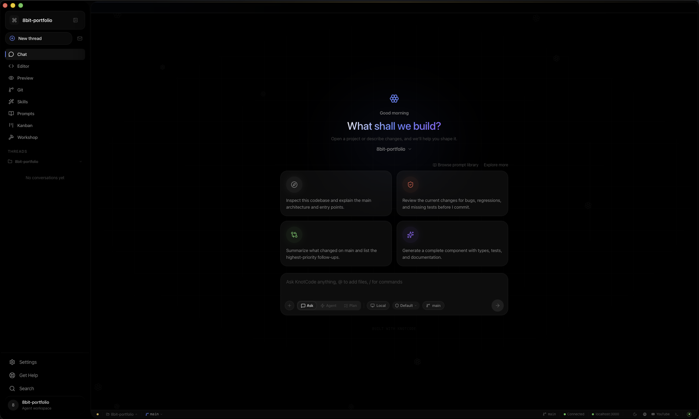
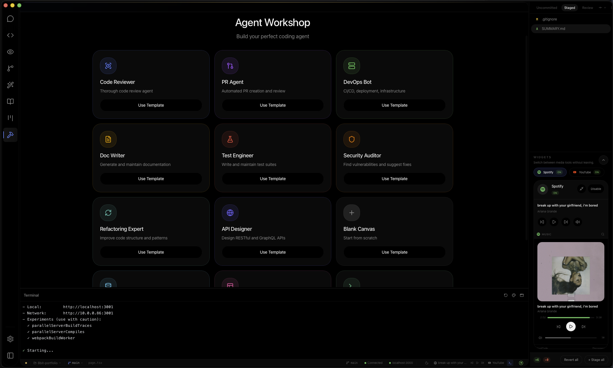
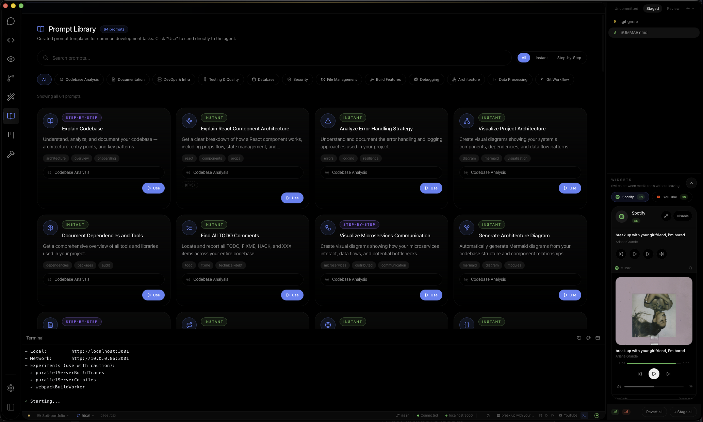
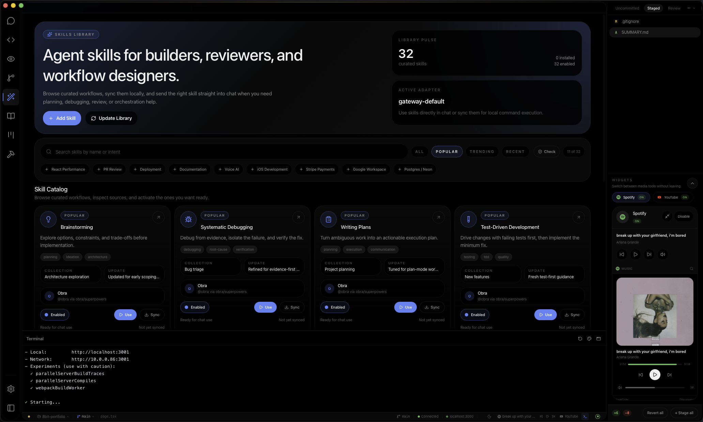
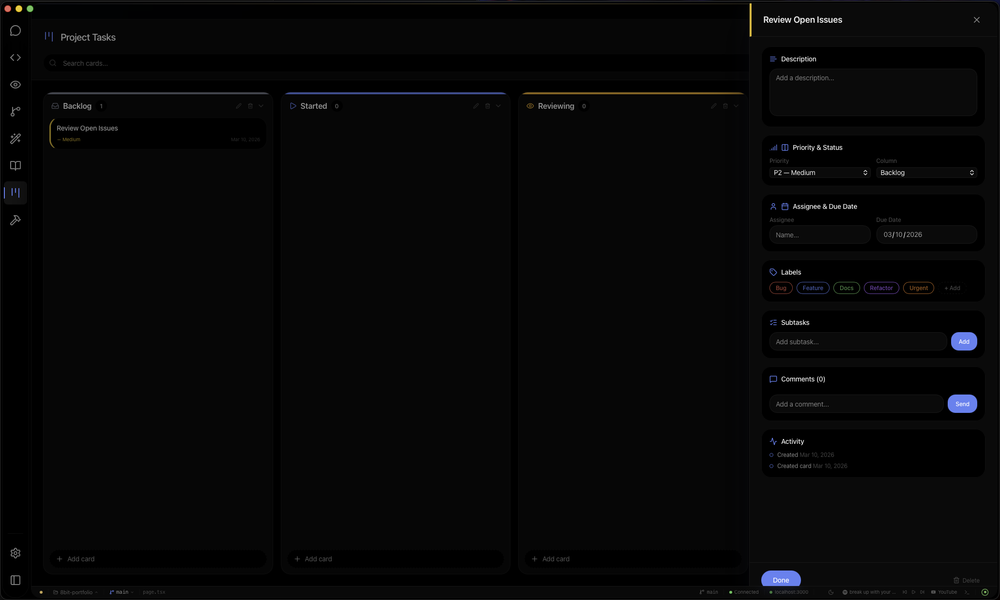
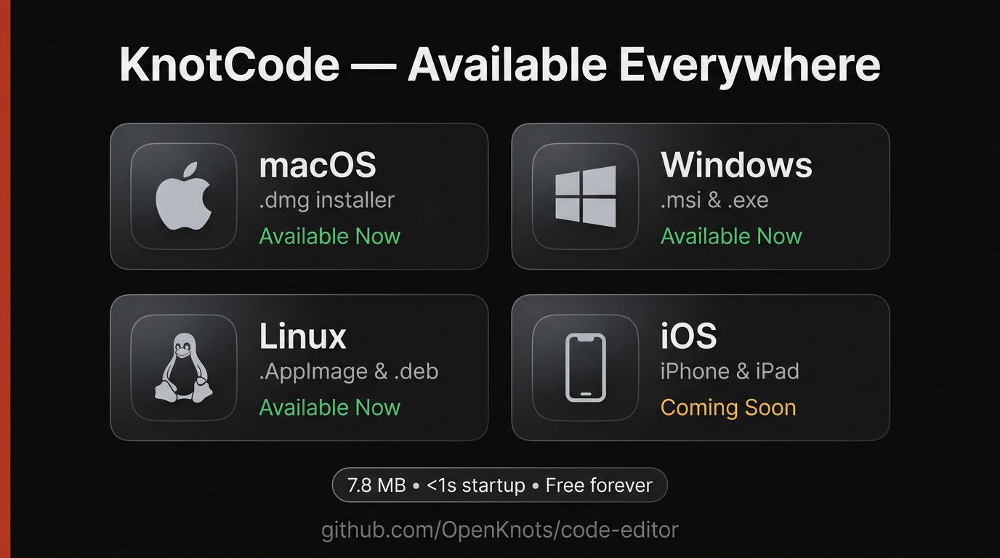

# Knot Code

**AI coding, without the bloat.**

A lightweight, AI-native code editor powered by [OpenClaw](https://github.com/openclaw/openclaw). Your agent, your gateway, your data. Desktop (macOS, Windows, Linux) + iOS + Browser.

<p align="center">
  
</p>

## Screenshots

|                   Chat                   |                 Agent Workshop                 |
| :--------------------------------------: | :--------------------------------------------: |
|  |  |

|                 Prompt Library                 |                Skills Library                |
| :--------------------------------------------: | :------------------------------------------: |
|  |  |

|                Project Tasks                 |
| :------------------------------------------: |
|  |

## How It Compares

|                          |       **Knot Code**       |   **Cursor**   |  **Windsurf**   | **VS Code + Copilot** | **Competitor Avg** |
| ------------------------ | :-----------------------: | :------------: | :-------------: | :-------------------: | :----------------: |
| **App Size**             |        **7.8 MB**         |    ~500 MB     |     ~450 MB     |     ~400 MB + ext     |    **~450 MB**     |
| **RAM (idle)**           |        **~80 MB**         |  500 MB–2 GB   |  400 MB–1.5 GB  |      300 MB–1 GB      |    **~750 MB**     |
| **RAM (AI active)**      |        **~120 MB**        |    1–10+ GB    |     1–4 GB      |      500 MB–2 GB      |    **~2.5 GB**     |
| **Startup**              |          **<1s**          |      3–8s      |      3–6s       |         2–5s          |      **~4s**       |
| **Electron?**            | ❌ Tauri (native WebKit)  |  ✅ Electron   |   ✅ Electron   |      ✅ Electron      |  **3/3 Electron**  |
| **AI Backend**           |     Your own gateway      |  Cursor cloud  | Windsurf cloud  |     GitHub cloud      |   **All cloud**    |
| **Data Privacy**         |      **100% local**       | Sent to Cursor | Sent to Codeium |    Sent to GitHub     |   **All cloud**    |
| **BYO Model**            | ✅ Any model via OpenClaw | ❌ Cursor only |   ❌ Limited    |    ❌ Copilot only    |      **0/3**       |
| **Custom System Prompt** |  ✅ Agent Builder wizard  |       ❌       |       ❌        |          ❌           |      **0/3**       |
| **Themes**               |        24 built-in        |       3        | VS Code themes  |    VS Code themes     |         —          |
| **Offline AI**           | ✅ Local models supported |       ❌       |       ❌        |          ❌           |      **0/3**       |
| **Subscription**         |     **Free forever**      |     $20/mo     |     $15/mo      |        $10/mo         |    **~$15/mo**     |
| **Open Source**          |       ✅ Apache 2.0       | ❌ Proprietary | ❌ Proprietary  |       Partially       |     **0.5/3**      |

> **Why so light?** Knot Code uses Tauri (Rust + native WebKit) instead of Electron. No bundled Chromium. No background processes phoning home. The AI runs through your own [OpenClaw](https://github.com/openclaw/openclaw) gateway — your keys, your models, your data stays on your machine.

## Platform Availability

<p align="center">
  
</p>

| Platform              | Format              | Status      |
| --------------------- | ------------------- | ----------- |
| macOS (Apple Silicon) | `.dmg`              | Available   |
| Windows (x64)         | `.msi`, `.exe`      | Available   |
| Linux (x64)           | `.AppImage`, `.deb` | Available   |
| iOS (iPhone/iPad)     | App Store           | Coming Soon |

## Quick Start

### Desktop

Download the [latest release](https://github.com/OpenKnots/code-editor/releases/latest) for your platform (`.dmg`, `.exe`, `.msi`, `.AppImage`, `.deb`).

After installing, macOS may show _"KnotCode is damaged"_ — this is because the app isn't notarized with Apple (yet). Fix it with:

```bash
xattr -cr /Applications/KnotCode.app
```

Or build from source:

```bash
pnpm install
pnpm desktop:dev          # dev mode (Tauri + hot reload)
pnpm desktop:build        # production build (.app + .dmg)
```

> First Tauri build takes 2-5 minutes (compiling Rust deps). Subsequent builds are fast.

### Web (self-hosted)

```bash
pnpm install
pnpm dev              # http://localhost:3080
pnpm build            # static export
```

### Prerequisites

- [OpenClaw](https://github.com/openclaw/openclaw) gateway running locally
- Node.js 20+
- pnpm

### Environment

Copy `.env.example` to `.env` and configure. All variables are optional — the editor works without them, but GitHub auth and plugins need their respective keys.

## Features

- **AI Agent Chat** — Ask, Agent, and Plan modes with streaming responses
- **Agent Builder** — Choose a persona, customize your system prompt, configure behaviors
- **Inline Edits** — Agent proposes changes, you review diffs and accept/reject per-hunk
- **24 Themes** — Claude, Supreme, Obsidian, Neon, Catppuccin, VooDoo, CyberNord, PrettyPink, and 16 more
- **Monaco Editor** — Multi-tab, Vim mode, syntax highlighting, Cmd/Ctrl+P quick open
- **GitHub Integration** — Token-based auth, commit, push, branch switching
- **Terminal** — Integrated xterm.js with gateway slash commands
- **Spotify + YouTube** — Built-in music and video plugins
- **Desktop Native** — Tauri v2 with local file system access, git operations, OS keychain

See [docs/FEATURES.md](docs/FEATURES.md) for the full feature list and roadmap.

## Architecture

See [docs/ARCHITECTURE.md](docs/ARCHITECTURE.md) for the technical architecture, data flow, and component map.

## Documentation

| Doc                                           | Description                                 |
| --------------------------------------------- | ------------------------------------------- |
| [FEATURES.md](docs/FEATURES.md)               | Feature list, status, and roadmap           |
| [ARCHITECTURE.md](docs/ARCHITECTURE.md)       | Technical architecture and component map    |
| [DEVELOPMENT.md](docs/DEVELOPMENT.md)         | Development workflow and conventions        |
| [DESKTOP.md](docs/DESKTOP.md)                 | Tauri desktop build details                 |
| [IOS.md](docs/IOS.md)                         | iOS application scope and rollout plan      |
| [AGENT.md](docs/AGENT.md)                     | AI agent integration                        |
| [TROUBLESHOOTING.md](docs/TROUBLESHOOTING.md) | Common issues and fixes                     |
| [SECURITY.md](SECURITY.md)                    | Security policy and vulnerability reporting |

## Keyboard Shortcuts

| Shortcut     | Action                         |
| ------------ | ------------------------------ |
| `Cmd/Ctrl+P` | Quick file open (fuzzy search) |
| `Cmd/Ctrl+K` | Inline edit at selection       |
| `Cmd/Ctrl+B` | Toggle file explorer           |
| `Cmd/Ctrl+I` | Toggle agent panel             |
| `Cmd/Ctrl+J` | Toggle terminal                |
| `Enter`      | Send message / Start chat      |
| `Esc`        | Close overlays                 |

## Tech Stack

- **Framework:** Next.js 16 + React 19 + TypeScript 5.9
- **Desktop:** Tauri v2 (Rust + system WebKit) — no Electron
- **Editor:** Monaco Editor with optional Vim mode
- **Terminal:** xterm.js with fit addon and web links
- **Styling:** Tailwind CSS v4 (CSS custom properties)
- **Icons:** @iconify/react (Lucide icon set)
- **Package Manager:** pnpm

## Contributing

See [CONTRIBUTING.md](CONTRIBUTING.md). PRs welcome.

## License

[Apache License 2.0](LICENSE) — Copyright 2025-2026 OpenKnot Contributors
